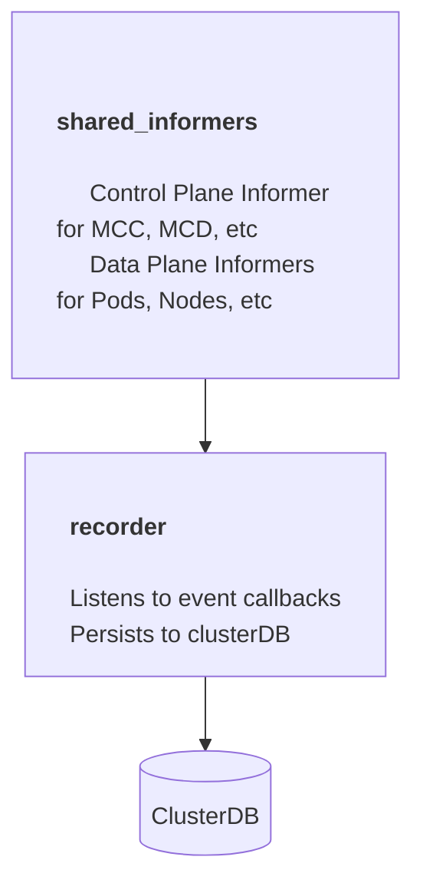
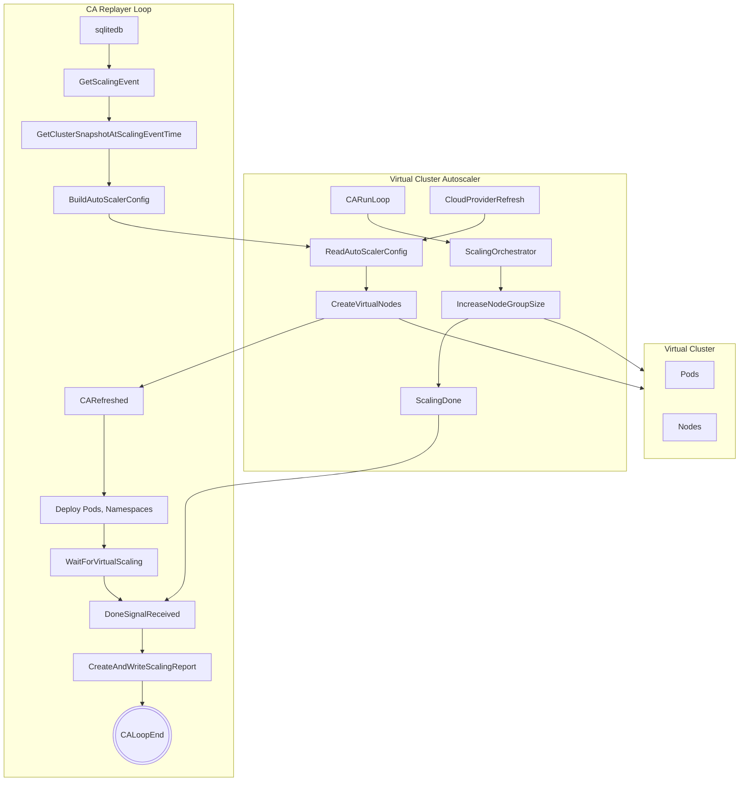
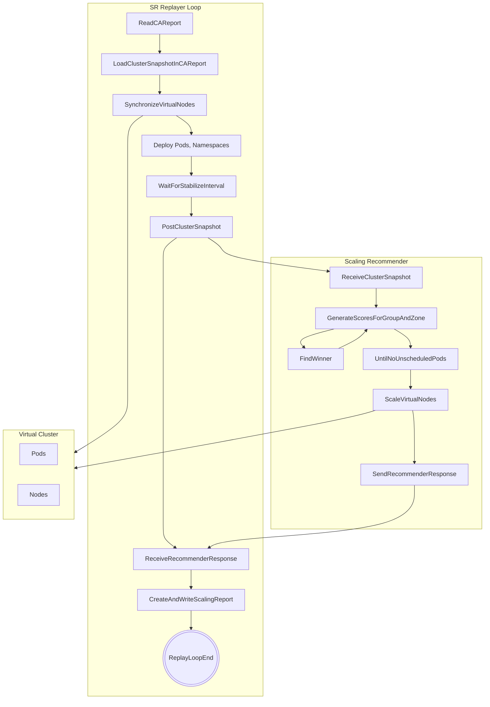

# gardener-scaling-history

> [!NOTE]
>  This is a prototype for PROOF OF CONCEPT *only*.

## Setup

Please refer to the [setup guide](docs/setup.md)

## Architecture

### Design

#### Recorder

- The `scaling-history-recorder` monitors a list of clusters defined inside a config map 
`scaling-history-recorder-config` and setups up [client-go Shared Informers](https://pkg.go.dev/k8s.io/client-go/informers) 
on the data and control plane of those clusters monitoring `Pod`, `Node`, `Events`, `MachineDeployments`, `MachineClasses` and CA `Deployment` 
and `ConfigMap`. 
- Recorded data is stored into a [SQLite](https://sqlite.org/) DB per cluster. Care is taken to minimize amount of data stored - skipping storage if no scaling relevant change is made

#### Replayer

* The replayer can replay scenarios against either the *VCA* (Virtual Cluster Autoscaler)
 or the *SR* (scaling recommender)
* This is primarily meant for simulating autoscaling  and hence ideally should be run against a virtual cluster like one setup by https://github.com/unmarshall/kvcl/

##### Virtual Cluster Autoscaler Replayer

* Virtual Cluster Autoscaler is a fork of the k8s `cluster-autoscaler` with a *virtual* provider implementation that scales virtual nodes on the virtual cluster
  
High level overview of the replay loop for the virtual CA replay run.

##### Scaling Recommender Replayer

High level overview of the replay loop for the scaling recommender replay run

### Deployment model

