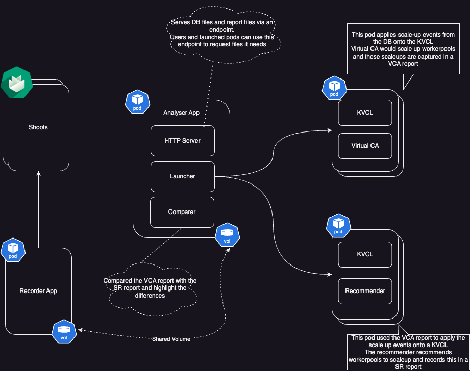

# gardener-scaling-history

> [!NOTE]
>  This is prototype for Proof of Concept only.

Repository providers 2 apps:
- recorder: monitors and records the scaling data for one or more gardner clusters: machine deployments, machine classes, priority classes, autoscaling config, scheduled and unscheduled pods, nodes, etc. Recorded data is dumped into a [SQLite](https://sqlite.org/) DB per cluster.
- replayer: The replayer can replay scenarios against either the virtual CA or the scaling recommender
  - replay-CA: replays the recorded scaling data of a gardener cluster against a virtual k8s cluster.
       - effectively deploys scheduled and un-scheduled pods in a configurable batch interval and waits till nodes belonging to CA node groups are scaled.
       - This is primarily meant for simulating autoscaling  and hence ideally should be run against a virtual cluster like one setup by https://github.com/unmarshall/kvcl/
  - replay-SR: replays the scenario json (produced by replay-CA) against the new scaling-recommender.

## Setup

Please refer to the [setup guide](docs/setup.md)

## Architecture

### Design

#### Recorder

//TODO: add a diag

#### Replayer

##### Virtual CLuster Autoscaler Replayer

##### Scaling Recommender Replayer

### Deployment model

